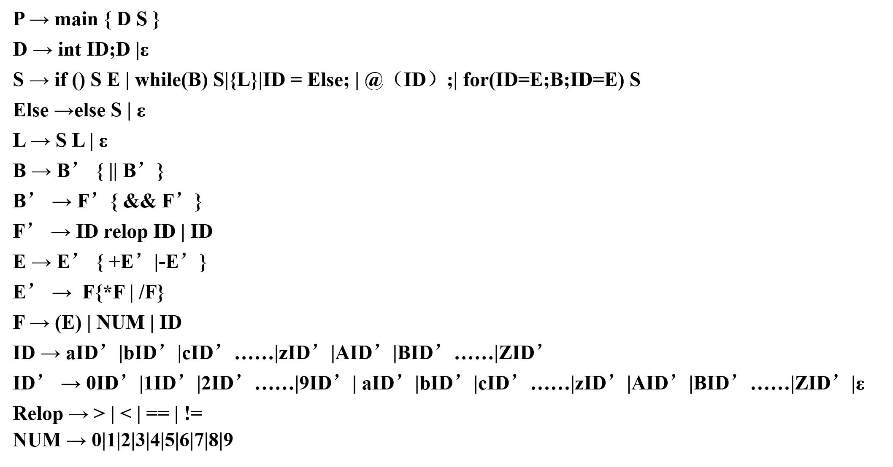
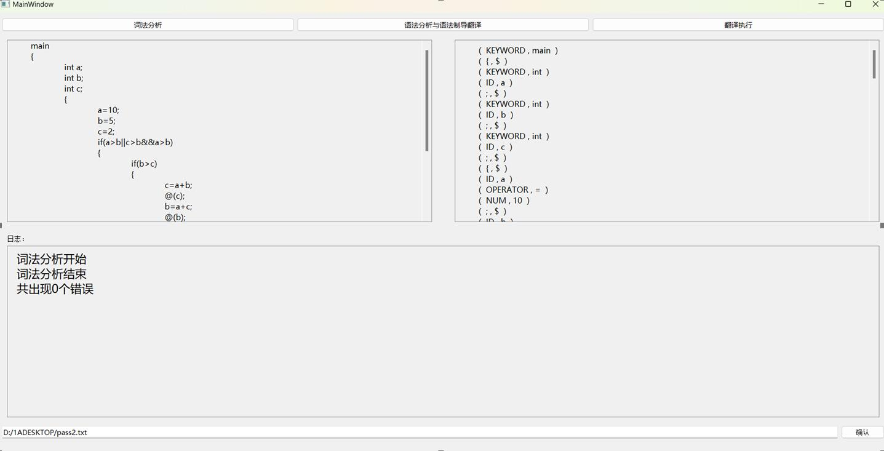
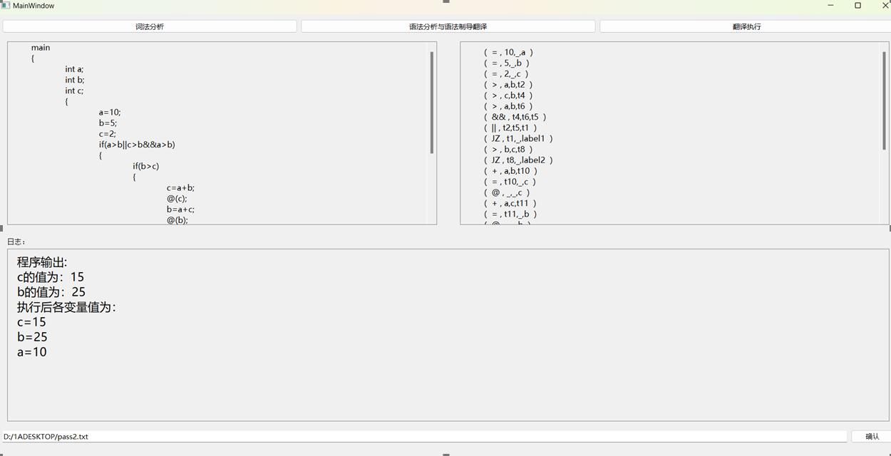
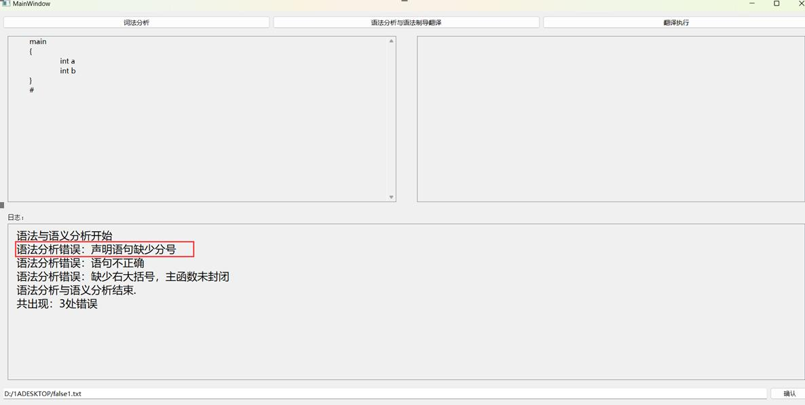
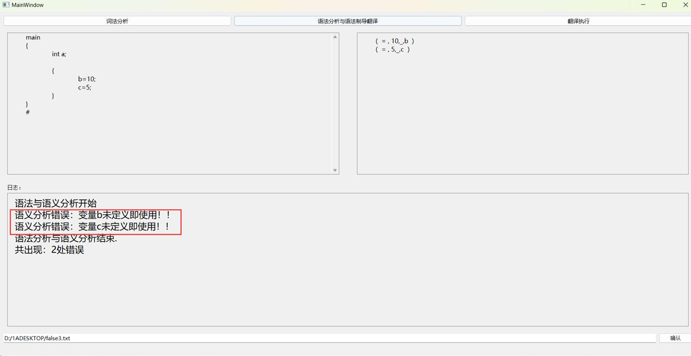

# 简易编译器

## 样本语言文法定义

其中第3行的@（ID)为输出语句，可以打印标识符ID的真实值。

## 文件介绍

- Code目录下为本项目源代码，包括C++文件.h，.cpp与QT界面文件.ui。本项目使用QT Creator4.11.0 Community开发，在QT Creator中打开Code.pro文件即可打开本项目工程文件。
- exe目录下为本项目可执行文件，双击exe目录下的Code.exe文件即可运行本项目。
- test目录下为本项目的测试样例，共包含五个正确样例:pass1.txt,pass2.txt,pass3.txt,pass4.txt,pass5.txt;和四个错误样例:false1.txt,false2.txt,false3.txt，false4.txt.

## 使用

使用时，需要在下方输入框中输入要编译文件的绝对路径，并单击右下角的“确认”按钮，再从左至右依次单击上方的“词法分析”，“语法分析与语法制导翻译”，“语义分析”即可进行对应功能的运行。注意只有当前一步骤没有出现报错时才可运行下一步骤。

#### 词法分析生成二元组

#### 语法分析与语法制导翻译生成四元式

#### 翻译程序对得到的四元式进行翻译

#### 错误处理

 